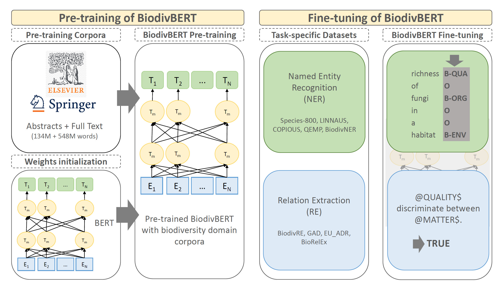
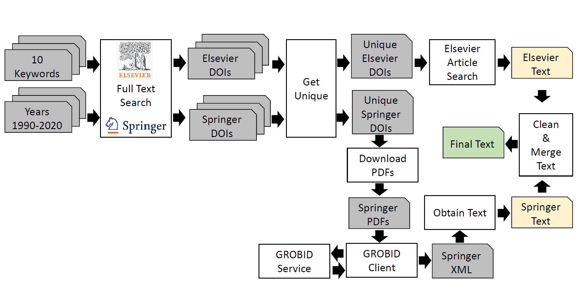

# BiodivBERT
Biodiversity domain language model. It is fine-tuned on 2 downstream tasks for Named Entity Recognition (NER) and Relation Extraction (RE) using various state-of-the-art datasets.


**Quick Download**
  * [BiodivBERT on Huggingface hub](https://huggingface.co/NoYo25/BiodivBERT) [](https://doi.org/10.5281/zenodo.6554141)
  * Pre-proccessed Datasets for Fine-tuning [](https://doi.org/10.5281/zenodo.6554208)
  * Pre-training corpora [](https://doi.org/10.5281/zenodo.6555690)


## Pre-training 
BiodivBERT Pre-training involves data crawling and pre-traing task. 
### Data Crawling
* Pre-training from scratch requires a large corpus of unlabeled text. We are interested in the biodiversity domain, thus, we crawl two well known publishers in the Life Sciences: Elsevier and Springer.
* We provide our [data_crawling](/data_crawling) script in this repo


**To crawl the data**:
* Make sure to create `elsevier_config.json` and `springer_config.json` with your API key
* Adjust the settings to the target API from the `config.py`, enable the correct API you want to crawl.
* Launch `main.py` to will crawl either the abstracts or the full text based on the settings you select in the `config.py` file.
* To ensure you will process unique DOIs and to avoid duplicate text at the end, run `filter_DOI.py` and specify the correct target, e.g., `targets=['Springer']`
  * This will create a text file with unique DOIs.
* To crawl the full text, you should ensure that `OPENACCESS=True` and `FULL=True` in the `config.py`
* The main will download the PDFs from Springer and the actual parsed text from Elsevier. 
* To obtain the full text from Springer, GROBID service must be hosted and the client is up and runing, for more information on how to setup GROBID, please [visit their page](https://github.com/kermitt2/grobid) and we recommend to use docker to establish the service.
  * We provide a wrapper for the client at `run_grobid.py`
* A data clean step is mandatory here, to do so, please run `data_clean.py` it will clean directory by directory based on the configuration.
* To create an train and evaluation sets, you can use `train_test_split.py`.

### Pre-training Code
* Pre-training code is published under this repo [\pre-training](/pre-training)
* We support 2 `config.py` files, one for abstracts and one for full text pre-training. 
  * Before you start pre-training, make sure you change the `root=Your data folder`
  * You can adjust the hyperparams, e.g., we select `pre_device_batch_size=16` is the maximum that could fit in a single V100 GPU in our case. 
* We recommend using the `datasets` library by HuggingFace to support efficient data loading.

## Fine-tuning 
* We have fine-tuned BiodivBERT on two down stream tasks: Named Entity Recognition & Relation Extration using the state-of-the-art datasets from biodiversity domain.

### Named Entity Recognition
* Datasets:
  * COPIOUS
  * QEMP 
  * BiodivNER
  * Species-800
  * LINNAEUS
* Code:
  * We have fine-tuned BiodivBERT for /NER on a single TPU provided by ColabPro for few hours per dataset.
### Relation Extraction 
* Datasets:
  *  GAD
  *  EU-ADR
  *  BioRelEx
  *  BiodivRE
*  Same as in NER, We have fine-tuned BiodivBERT for /RE on a single TPU provided by ColabPro for few hours per dataset.

### How to Use BiodivBERT

1. Masked Language Model
````buildoutcfg
from transformers import AutoTokenizer, AutoModelForMaskedLM

tokenizer = AutoTokenizer.from_pretrained("NoYo25/BiodivBERT")

model = AutoModelForMaskedLM.from_pretrained("NoYo25/BiodivBERT")
````

2. Token Classification - Named Entity Recognition
````buildoutcfg
from transformers import AutoTokenizer, AutoModelForTokenClassification

tokenizer = AutoTokenizer.from_pretrained("NoYo25/BiodivBERT")

model = AutoModelForTokenClassification.from_pretrained("NoYo25/BiodivBERT")
````

3. Sequence Classification - Relation Extraction
````buildoutcfg
from transformers import AutoTokenizer, AutoModelForSequenceClassification

tokenizer = AutoTokenizer.from_pretrained("NoYo25/BiodivBERT")

model = AutoModelForSequenceClassification.from_pretrained("NoYo25/BiodivBERT")
````

## Citation
